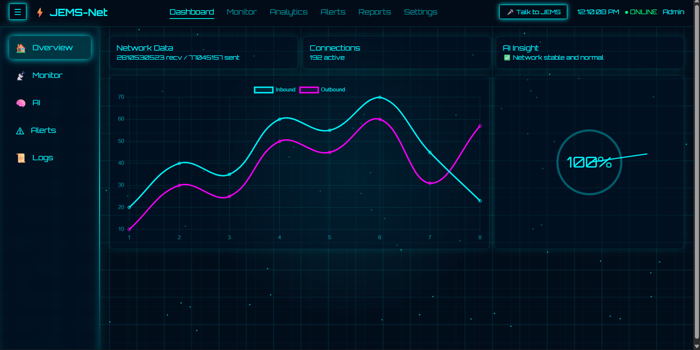
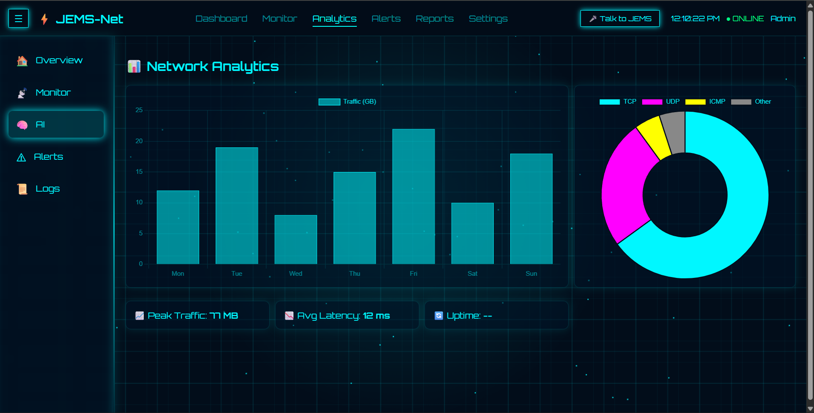
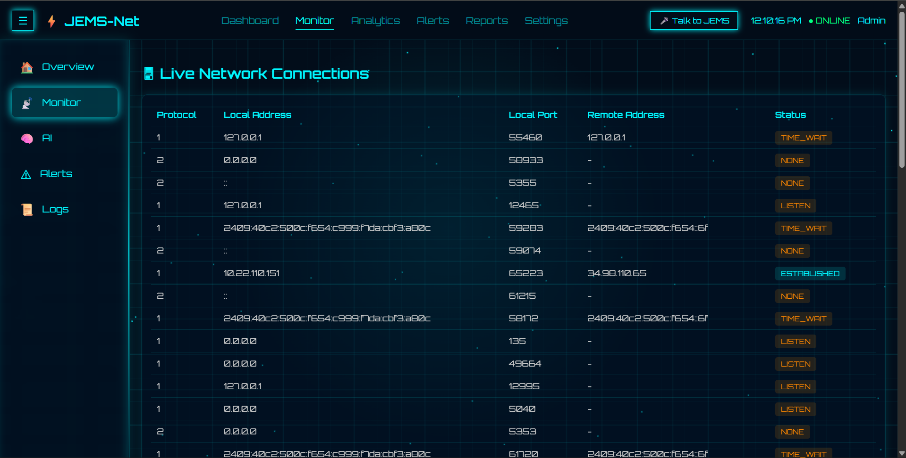
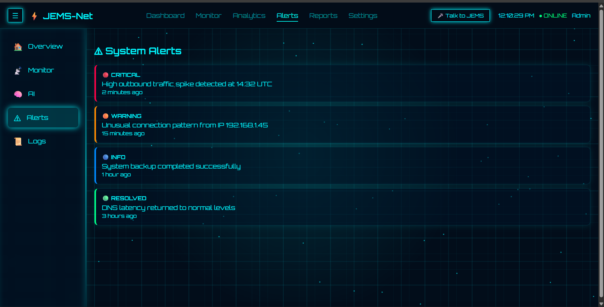
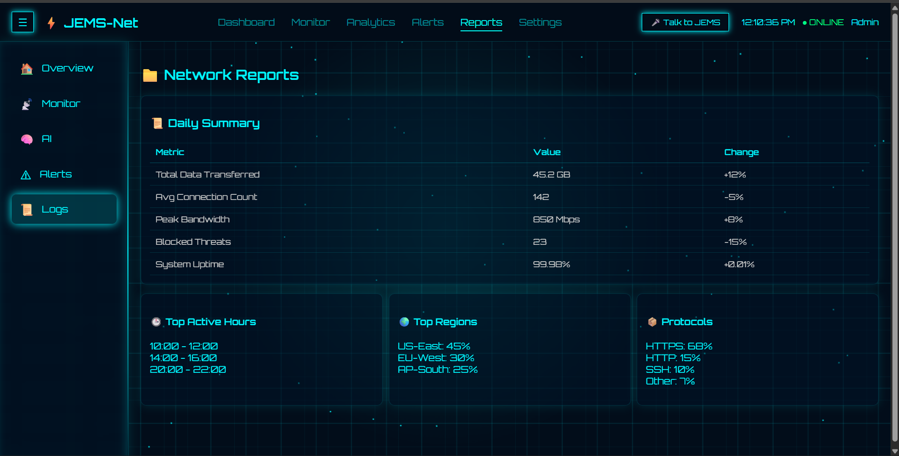
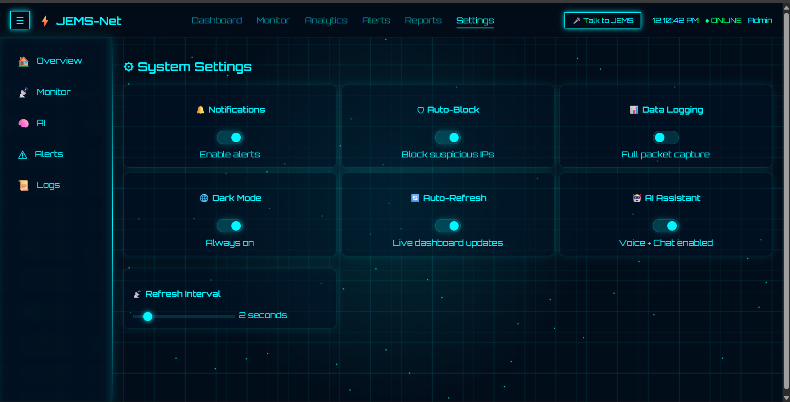

# JEMS-Net

AI-Powered Network Intelligence System

## Overview
JEMS-Net is an AI-driven Network Intelligence System developed for intelligent monitoring, predictive analysis, anomaly detection, and smart network management using machine learning and real-time analytics.

The system is designed to improve network visibility, automate monitoring processes, and provide intelligent insights for future-ready network infrastructures.

---

## Key Features
- Real-time network monitoring
- AI-based predictive analysis
- Traffic visualization dashboard
- Intelligent anomaly detection
- Reporting and analytics system
- Smart alert management
- Interactive monitoring interface

---

## Technologies Used
- Python
- HTML
- CSS
- JavaScript
- Machine Learning
- Networking Concepts

---

## Project Modules
- Dashboard System
- Analytics Module
- Monitoring Interface
- Reports Management
- Alert System
- AI Intelligence Components

---

## Applications
- Smart Network Monitoring
- Intelligent Infrastructure Management
- AI-based System Analytics
- Future Cybersecurity Systems
- Research and Defense Technology Concepts

---

## Future Scope
- Advanced threat detection
- Autonomous AI monitoring
- Intelligent cybersecurity integration
- Cloud-based monitoring system
- Real-time AI-driven defense analytics

---
---

## Project Preview

### Dashboard

### Analytics

### Monitoring

### Alerts

### Reports

### Settings

## Author
Aryan Kamble

AIML Engineering Student | AI & Network Systems Enthusiast
